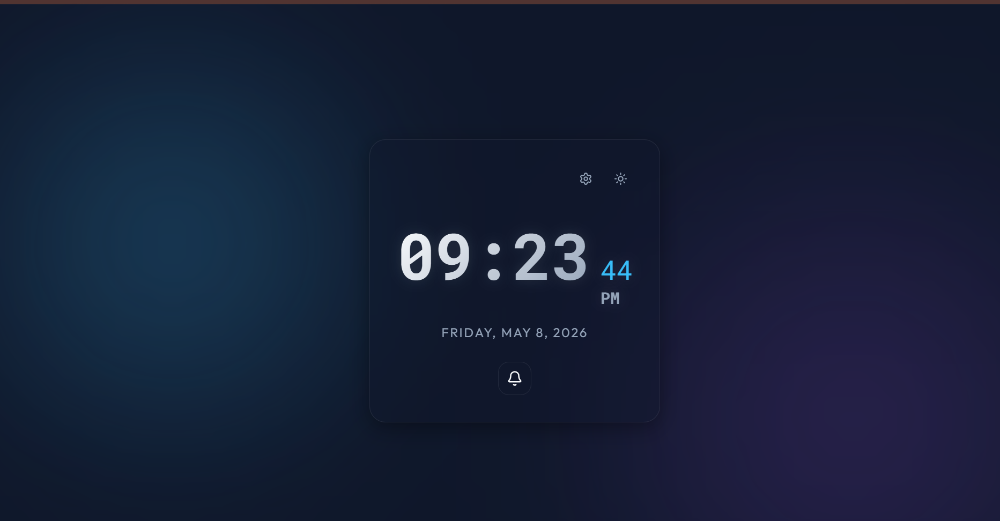

# ⏰ Digital Clock MERN Stack

<div align="center">

# ✨ Premium Glassmorphism Digital Clock ✨

### Aesthetic • Responsive • Real-Time • MERN Stack Powered

A modern and beautifully crafted **Digital Clock Web Application** built using the **MERN Stack** featuring real-time updates, alarm management, elegant glassmorphism UI, animated gradients, and dynamic dark/light themes.

<br>


</div>

---

# 📸 Application Preview

<div align="center">



</div>

---

# 🌟 Key Features

## 🕒 Real-Time Clock
- Live real-time digital clock updates
- Highly accurate second-by-second synchronization
- Supports both:
  - 12-Hour Format
  - 24-Hour Format

---

## ⏰ Alarm Management System
- Add multiple alarms
- Enable / Disable alarms
- Delete alarms instantly
- Persistent storage using MongoDB
- Elegant alarm interaction UI

---

## 🎨 Premium UI / UX
- Modern Glassmorphism Design
- Smooth hover animations
- Beautiful gradient backgrounds
- Minimal and elegant layout
- Micro-interactions and transitions
- Professional dark theme aesthetics

---

## 🌗 Dynamic Theme Support
- 🌙 Dark Mode
- ☀️ Light Mode
- Smooth animated theme switching

---

## 📱 Fully Responsive
Optimized for:
- 💻 Desktop
- 📱 Mobile Devices
- 📟 Tablets

---

# 🛠️ Tech Stack

| Frontend | Backend | Database | Tools |
|----------|----------|-----------|-------|
| React.js | Node.js | MongoDB | Vite |
| CSS3 | Express.js | Mongoose | Git |

---

# 📂 Project Structure

```bash
assignment/
│
└── digital-clock-mern/
    │
    ├── backend/
    │   ├── node_modules/
    │   ├── package-lock.json
    │   ├── package.json
    │   └── server.js
    │
    ├── frontend/
    │   ├── node_modules/
    │   ├── public/
    │   ├── src/
    │   ├── .gitignore
    │   ├── eslint.config.js
    │   ├── index.html
    │   ├── package-lock.json
    │   ├── package.json
    │   ├── README.md
    │   └── vite.config.js
    │
    └── README.md
```

---

# ⚙️ Installation & Setup

## 📌 Prerequisites

Before running the project, ensure the following are installed:

- Node.js
- MongoDB
- Git

---

# 🚀 Backend Setup

```bash
cd backend
npm install
node server.js
```

✅ Backend server runs on:

```bash
http://localhost:5000
```

---

# 💻 Frontend Setup

```bash
cd frontend
npm install
npm run dev
```

✅ Frontend server runs on:

```bash
http://localhost:5173
```

---

# 🌐 Environment Variables

Create a `.env` file inside backend folder:

```env
PORT=5000
MONGO_URI=mongodb://localhost:27017/digital-clock
```

---

# 🎯 API Endpoints

| Method | Endpoint | Description |
|--------|-----------|-------------|
| GET | `/alarms` | Fetch all alarms |
| POST | `/alarms` | Add new alarm |
| PUT | `/alarms/:id` | Toggle alarm |
| DELETE | `/alarms/:id` | Delete alarm |

---

# 🎨 UI Highlights

✨ Glassmorphism Interface  
✨ Gradient Glow Effects  
✨ Smooth Animations  
✨ Floating Shadows  
✨ Elegant Typography  
✨ Interactive Alarm Controls  
✨ Responsive Design  
✨ Modern Minimal Layout  

---

# 🚀 Future Enhancements

- 🔔 Custom Alarm Sounds
- 🌍 World Clock Support
- 📅 Calendar Integration
- ☁️ Cloud Alarm Sync
- 📲 Push Notifications
- 🎵 Spotify Alarm Integration

---


# 🧠 Why This Project?

This project combines:
- Modern frontend aesthetics
- Real-time functionality
- Backend integration
- Database persistence
- Responsive design principles

It demonstrates strong full-stack MERN development skills with focus on UI/UX engineering.

---

# 📜 License

This project is licensed under the MIT License.

---

# 👨‍💻 Developer

## Made with ❤️ using MERN Stack

### Developed by Priya

---

<div align="center">

# ⭐ If You Like This Project, Give It a Star ⭐

</div>
